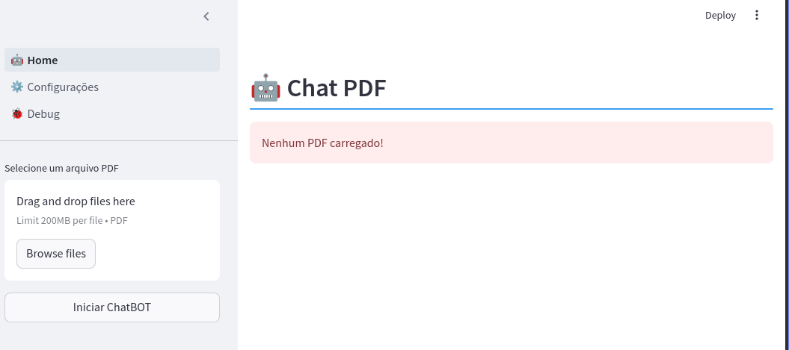
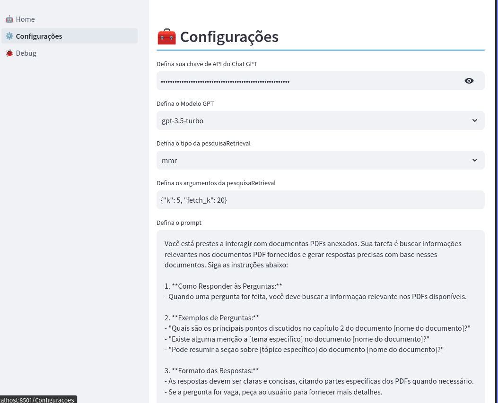
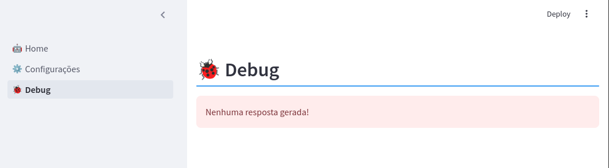

# Chat PDF com Streamlit e Langchain

## Descrição

O Obejetivo deste projeto é criar uma interface amigavel para o uso do Chat GPT em conversas de arquivos PDFs. Para isso, utilizaremos o framework Streamlit e o framework Langchain.

Uma amostra do aplicativo em execução pode ser encontrada [aqui!](https://chatpdf-7aoyv22kzuqebi58nu2yyv.streamlit.app/).

## Requisitos

* Ter o python Instalado. o Download poder ser feito [[aqui!]](https://www.python.org/downloads/)

* Possuir uma API do chat_GPT, pode obter uma conta [aqui!](https://platform.openai.com/).

* Realize a instalação das dependências no terminal.

```bash
pip install -r requirements.txt
```

## Como Usar

* abra um terminal e navegue ate o diretorio do projeto.

* execute o comando `streamlit run 🤖_Home.py` no terminal.

## imagens





